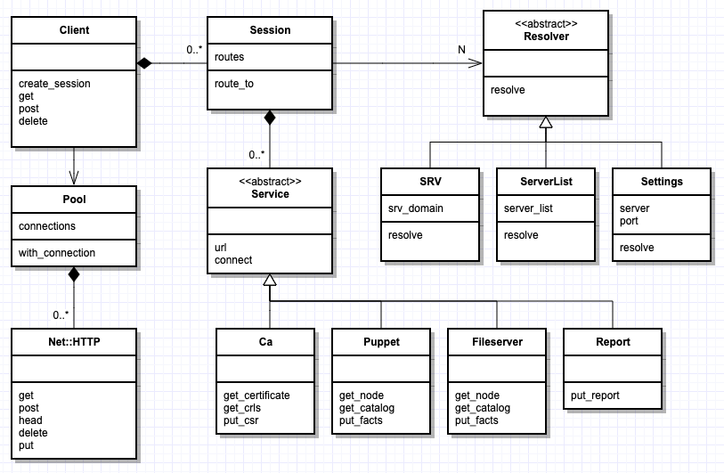
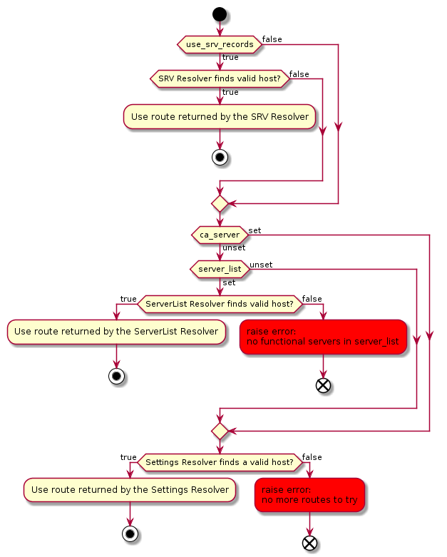

# HTTP Client

<!-- markdown-toc start - Don't edit this section. Run M-x markdown-toc-refresh-toc -->
**Table of Contents**

- [HTTP Client](#http-client)
    - [Problems](#problems)
        - [REST Client](#rest-client)
        - [Persistent connections](#persistent-connections)
        - [Routing](#routing)
        - [Inconsistencies](#inconsistencies)
        - [Error Handling](#error-handling)
        - [SSL Trust Stores](#ssl-trust-stores)
    - [Proposal](#proposal)
        - [Goals](#goals)
        - [Non-Goals](#non-goals)
    - [Design](#design)
        - [Classes](#classes)
            - [Client](#client)
            - [Connection Pool](#connection-pool)
            - [Route](#route)
            - [Service](#service)
            - [Resolvers](#resolvers)
            - [Session](#session)
        - [Routing](#routing-1)
            - [DNS SRV](#dns-srv)
            - [Server List](#server-list)
            - [Default Puppet Settings](#default-puppet-settings)
        - [Generic HTTP(S) Requests](#generic-https-requests)
        - [Puppetserver](#puppetserver)

<!-- markdown-toc end -->

## Problems

This is a proposal to restructure the HTTP client code in puppet to solve the
following problems.

### REST Client

It's difficult to use puppet as a library to call our own REST APIs due to the
coupling of puppet's http code with the indirector. As a result, users have
created REST clients, but they don't behave the same way our agent does, such as
serialization and deserialization of rich data, `server_list` for high
availability, and JSON to PSON content negotiation, etc.

It would be beneficial to the puppet ecosystem to have an REST client that's
reusable by more than the agent.

### Persistent connections

Persistent HTTP connections allow puppet to establish an HTTP(S) connection once
and reuse it for multiple HTTP requests. This avoids making a new TCP connection
and SSL handshake for each request. This is important for pluginsync, due to the
large number of individual GET requests. However, persistent connections are not
enabled by default, and must be opted into, as was recently done for `puppet
device` and `puppet plugin download`. More than likely, other applications
should be using persistent connections, but aren't.

### Routing

Puppet supports 3 ways of routing connections: DNS SRV records, server list, and
static puppet settings. However, some routing methods are not consistently
applied. For example, `puppet plugin download` and `puppet report upload` don't
observe server list.

Once a route has been determined, puppet stores the last used server and port in
Puppet's context system, but it's more of a hack than anything. As a result,
it's difficult to know how the last used server and port were set and when to
invalidate them.

### Inconsistencies

`Puppet::Network::HTTP::Connection` supports two ways of making GET and POST
requests, but they don't behave consistently when handling HTTP redirects, the
`Retry-After` header, server and proxy authentication, and exception handling.

### Error Handling

The `Puppet::Network::HttpPool` and related classes don't specify which
exceptions can be raised. Instead they pass through whatever exceptions ruby
raises. Everything from `SocketError` to `SystemCallError` to
`OpenSSL::SSL::SSLError` to `Net::ProtocolError` and `TimeoutError`. As a
result, it's hard for clients to build higher level abstractions.

### SSL Trust Stores

Puppet only trusts the puppet PKI when connecting to puppet infrastructure, but
needs to additionally trust the system cert store for requests like PMT and
downloading files from https sources. However, the current API doesn't allow the
caller to do that, which is why `Puppet::Util::HttpProxy#request_with_redirects`
duplicates the logic from`Puppet::Network::HTTP::Connection#request_with_redirects`.

## Proposal

In order to solve these problems, I propose creating an HTTP client in puppet
with the following goals:

### Goals

* Implement a REST client in puppet capable of serializing/deserializing puppet
  objects like Catalog, Report, etc.
* Reuse the existing networking code as much as possible, such as
  `Puppet::Network::HTTP::Pool`, but restructure it with a clear API.
* Always use persistent connections unless the caller explicitly opts out.
* Handle server resolution (via DNS SRV, etc) in a consistent way.
* Define an exception hierarchy for the API so that `Net::HTTP` specific
  exceptions don't leak out.
* Make it possible to use the system trust store for a single HTTPS request.

### Non-Goals

* Ruby's builtin `Net::HTTP` library is fairly buggy, however, we're not switching
  away from it right now. We may in the future, but it's out of scope.
* Serialization of puppet domain objects requires pops, rich data and loaders.
  As a result, creating a standalone puppet-http gem is out of scope.

## Design

### Classes



#### Client

Has a pool of persistent HTTP connections and creates HTTP sessions. Closes
persistent connections when its close method is called.

Has low-level HTTP methods, such as `get`, `post`, etc which take the path,
headers, options, and allow the caller to stream the request and response body.
Returns `Puppet::HTTP::Response` with the response code, etc.

#### Connection Pool

Maintains the pool of persistent `Net::HTTP` connections, keeping track of when
idle connections expire. The `with_connection` method takes a block, which
ensures borrowed connections are always returned to the pool.

#### Route

Defines a route to a REST service. Includes the API prefix, DNS SRV service name,
and puppet server and port settings for that service.

#### Service

Represents an instance of a puppet web service. Includes the URL used to connect
to the service, such as `https://puppet:8140/puppet/v3`. There are four
services: `ca`, `report`, `fileserver`, and the default `puppet`.

The `ca` and `report` services handle certs and reports, respectively. The
`fileserver` service handles puppet file metadata and content requests, such as
pluginsync and file resources with `source => 'puppet://'`. The `puppet` service
handles nodes, facts, and catalogs, and is also the fallback for the other three
services.

Each service is responsible for serializing/deserializing the HTTP entity into a
domain object. It uses the existing `Puppet::Network::Format` code to do so.

#### Resolvers

Each resolver represents a different strategy for resolving a service name into
a list of candidate servers and ports.

#### Session

Represents an HTTP session through which services may be connected to and accessed.

Has a `Session#route_to` method to route to a web service based on the requested
service name and client configuration:

```ruby
client = Puppet::HTTP::Client.new
session = client.create_session
service = session.route_to(:ca)
cert = service.get_certificate('foo')
puts "Retrieved cert #{cert.subject.to_utf8} from #{service.url}"
```

The `Session#route_to(:ca)` method (above) returns an instance of
`Puppet::HTTP::Service::Ca`, which has methods appropriate for that type of
service. All services extend `Puppet::HTTP::Service`.

### Routing

If an explicit server and port are specified on the command line or
configuration, such as `puppet agent -t --server foo.example.com`, then the
`Session#route_to` method will always return a `Service` with that host and port.

Otherwise, the session will walk the list of resolvers in priority order:

* DNS SRV
* Server list
* Puppet server/port settings

If the `route_to` method attempts to connect to a service, but it results in an
exception, such as "connection refused", then the session will attempt the next
service.

If the caller successfully uses a service, then the session will return the same
service the next time `route_to` is called again.

#### DNS SRV

The DNS SRV resolver performs an SRV lookup, and randomly selects one of the
targets based on the weight of each entry in the SRV record. A target with
weight 2 would be twice as likely to be chosen as a target with weight 1.

```ruby
client = Puppet::HTTP::Client.new(use_srv: true, srv_domain: 'puppet.example.com')
session = client.create_session
service = session.route_to(:ca)
# service.url is "https://compiler1.puppet.example.com:8140"
```

#### Server List

The server list resolver selects the first available server using puppetserver's
simple status endpoint. This applies when routing requests to the `:puppet`
service, as well as any service whose server and port are the same as the
`:puppet` service. For example, when `:ca_server` and `:report_server` have not
been overridden.

```ruby
client = Puppet::HTTP::Client.new(server_list: ['compiler1', 'compiler2'])
session = client.create_session
service = session.route_to(:puppet)
# service.url is "https://compiler1:8140"
```

#### Puppet Settings

The resolver selects a route based on the puppet settings for that service:

| service    | server setting | port setting |
|------------|----------------|--------------|
| ca         | ca_server      | ca_port      |
| fileserver | server         | masterport   |
| report     | report_server  | report_port  |
| puppet     | server         | masterport   |

For example, `route_to(:report)` would use `Puppet[:report_server]` and
`Puppet[:report_port]`.

#### Example: CA Service Routing

There are some variations in how the different services are routed. Here is a
visual of how the CA service is routed. We have to preserve some [interesting behavior](https://github.com/puppetlabs/puppet/blob/master/lib/puppet/http/client.rb#L243-L249)
with this service, but otherwise the flow is similar to that of other services.



### Generic HTTP(S) Requests

Puppet agents support downloading file content from 3rd party file servers,
which reduces load on the compiler. The `Client` will provide a low-level API
for making `GET` requests for an arbitrary URL, and streaming the response body.

Puppet only trusts the puppet PKI for its REST requests. However, it should be
possible to additionally trust the system store when making HTTPS requests:

```ruby
client = Puppet::HTTP::Client.new
response = http.get("https://artifactory.example.com/java.tar.gz", trust_system_store: true)
response.read_body do |data|
  puts "Read #{data.bytes}"
end
```

### Puppetserver

Puppet ruby code running in puppetserver sometimes make outbound connections
such as the [puppetdb
terminus](https://github.com/puppetlabs/puppetdb/blob/6.5.0/puppet/lib/puppet/util/puppetdb/http.rb#L138),
PE classifier terminus, and ['http' report
processor](https://github.com/puppetlabs/puppet/blob/6.7.0/lib/puppet/reports/http.rb#L32).
Currently, puppetserver registers its own http client class, so that it can
perform the HTTP request using Apache HttpClient.

In order to preserve this capability, puppetserver should have a way of
overriding the `get` and `post` methods of `Puppet::HTTP::Client` to call the
Apache HttpClient instead.

One way might be to create an adapter that overrides Puppet's implementation and
delegates to [puppetserver's
client](https://github.com/puppetlabs/puppetserver/blob/f718994c0f32f8c697daa662ec4074e4596350fc/src/ruby/puppetserver-lib/puppet/server/http_client.rb#L23):

```ruby
class Puppet::Server::HttpClientAdapter < Puppet::HTTP::Client
  def initialize(http_client)
    super
    @http_client = http_client
  end

  def get(url, headers={}, options={})
    @http_client.get(url, headers, options)
  end

  # etc
end
```

And register it with puppet:

```ruby
Puppet.push_context(http_client: HttpClientAdapter.new(Puppet::Server::HttpClient.new))

```
